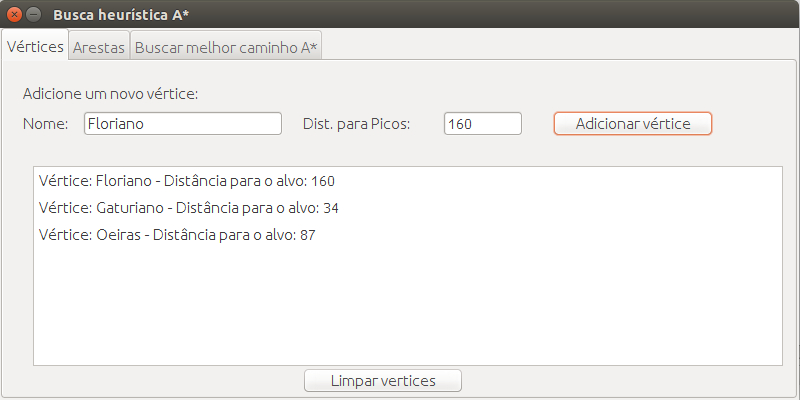

# AlgoritmoBuscaHeurísticaA*

Neste projeto é utilizado o algoritmo A* (A Star) para definir a menor rota entre dois pontos num mapa.
 

Passo-a-Passo:

Execute o arquivo RequisicaoDoAlvo.java e siga as instruções.

1. Informe o alvo (Objetivo) e entre;

2. Na aba "Vértices", adicione todos os pontos do mapa com suas respectivas distâncias heurísticas para o ponto alvo;

3. Na aba "Arestas", configure todas as arestas de um ponto ao outro, inclusive as distâncias das mesmas;

4. Vá para a aba "Buscar melhor caminho A*" e defina um ponto de partida. "Vá pelo menor caminho!" fará o calculo necessário para a busca da menor rota, esta que é exibida no campo de logs.

Screenshot:

